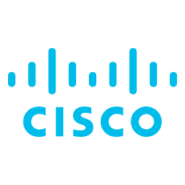

# Cisco ASA Logic Apps connector and playbook templates

 

## Table of Contents

1. [Overview](#overview)
1. [Authentication](#authentication)
1. [Prerequisites](#prerequisites)
1. [References](#references)

## Overview
Cisco Adaptive Security Appliance (ASA) Software is the core operating system for the Cisco ASA Family. It delivers enterprise-class firewall capabilities for ASA devices in an array of form factors - standalone appliances, blades, and virtual appliances - for any distributed network environment. ASA Software also integrates with other critical security technologies to deliver comprehensive solutions that meet continuously evolving security needs. 
This integration allows to automate response to Azure Sentinel incidents which contain IPs. It contains the basic connector component, with which you can create your own playbooks that interact with Cisco ASA.
It also contains 3 playbook templates, ready to quick use, that allow direct response on Cisco ASA from Microsoft Teams.

# Cisco ASA connector documentation 

## Authentication
This connector supports the following authentication types:
* Basic Authentication

### Basic Authentication
In Cisco ASA create a local user and allow it to use the REST API. Depending on the playbook used the user needs to be able to add members to a network object group or create access control entries, by default that requires privilege level 15.

### Prerequisites for using and deploying Cisco ASA Connector
The connector needs to be able to reach the Cisco ASA REST API. A few options are:
1. Over the internet
1. Using Logic Apps gateway
1. Secure tunnel between your network and Azure

#### Over the internet
You can make the Cisco ASA REST API available to the internet. You can use IP filtering to restrict access. To find the IP addresses that need access, go to your Logic App instance and go to properties. The field 'Connector outgoing IP addresses' contains the IP addresses Azure uses for your Logic App to call the connector. Logic Apps also needs to be able to validate the SSL certificate used.

#### Using Logic Apps gateway
On a server in your network install the on-premises data gateway, see [Install on-premises data gateway for Azure Logic Apps](https://docs.microsoft.com/en-us/azure/logic-apps/logic-apps-gateway-install).
The server on which the data gateway is installed needs to be able to reach the Cisco ASA REST API. Also the SSL certificate used by the Cisco ASA REST API needs to be able to be validated on the server, including the certificate chain.
When deploying the Cisco ASA connector choose the option via on-premises data gateway.
When using the connector you will be asked to select the data gateway you want to use.

#### Secure tunnel between your network and Azure
Create an Azure Virtual Network and connect it to your on-premise network using Azure VPN, for a sample see [Sample configuration: Cisco ASA device (IKEv2/no BGP)](https://docs.microsoft.com/en-us/azure/vpn-gateway/vpn-gateway-3rdparty-device-config-cisco-asa). When creating the Logic App make sure to select the option 'Associate with integration service environment'. When the Logic App is created you can connect it to the Azure Virtual Network. See (Connect to Azure virtual networks from Azure Logic Apps by using an integration service environment [Connect to Azure virtual networks from Azure Logic Apps by using an integration service environment (ISE)](https://docs.microsoft.com/en-us/azure/logic-apps/connect-virtual-network-vnet-isolated-environment)] and [Access to Azure Virtual Network resources from Azure Logic Apps by using integration service environments (ISEs)](https://docs.microsoft.com/en-us/azure/logic-apps/connect-virtual-network-vnet-isolated-environment-overview) for documentation.

## Learn more
*  [Cisco ASA REST API Quick Start Guide](https://www.cisco.com/c/en/us/td/docs/security/asa/api/qsg-asa-api.html)
